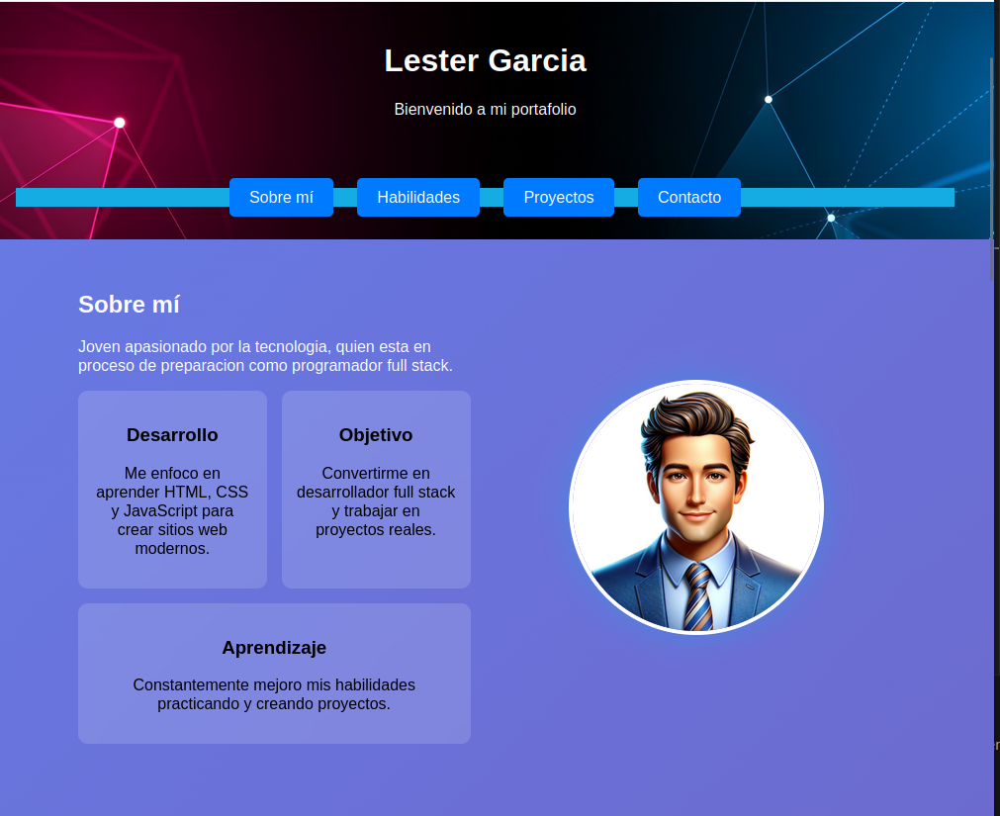
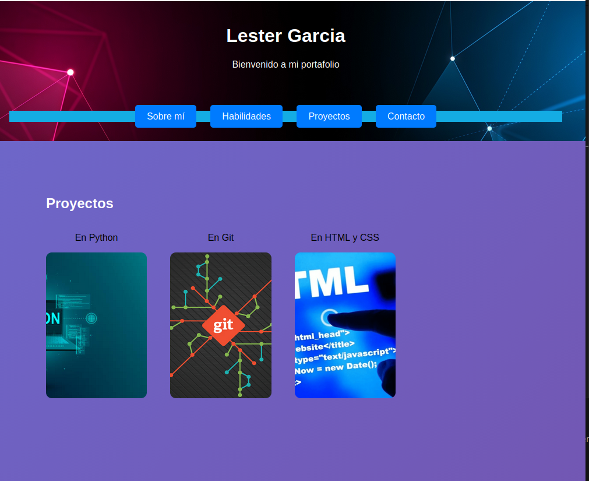
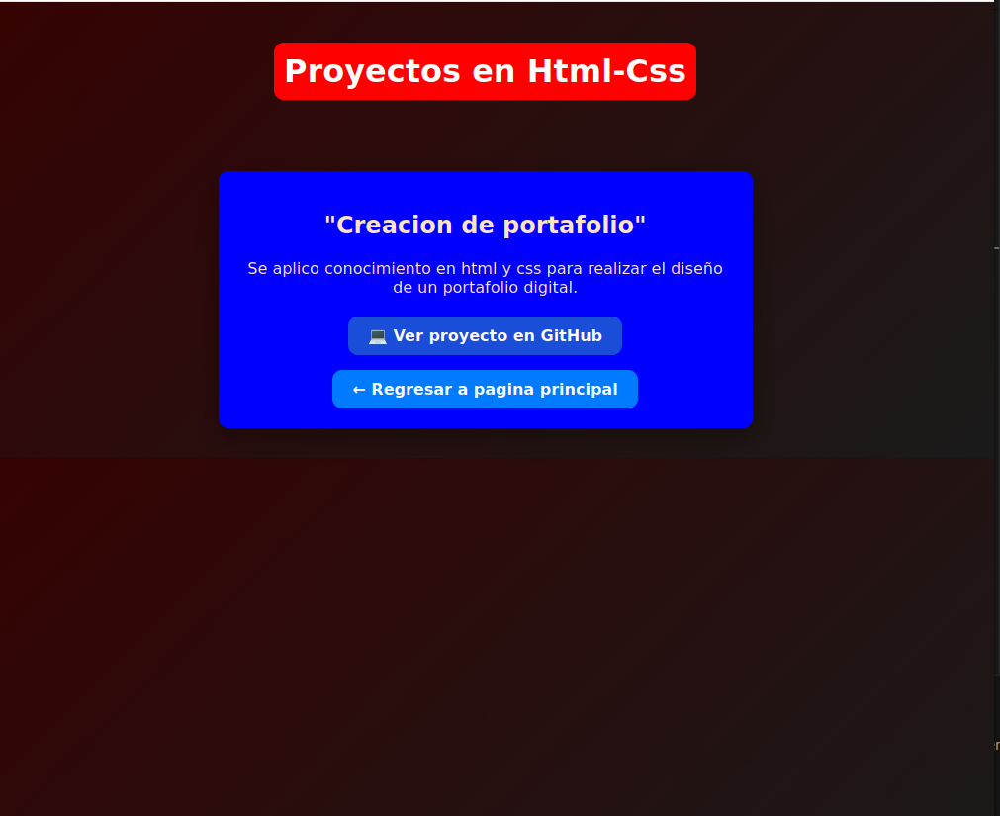

# 📌 Proyecto en html y Css
## Descripcion del proyecto
**La realización de mi portafolio web utilizando HTML y CSS ha sido un proceso importante para presentar de manera organizada y profesional mis habilidades y proyectos en el entorno digital. A través de este proyecto, he creado una página web personal en la que muestro información sobre mí, como mis datos personales, mi formación académica, mis habilidades técnicas y los trabajos que he realizado.**

## ⚙️Tecnologias Aplicadas
*visual code*

*github*

*html*

*Css*

## 🖥️ Capturas del proyecto

## ⭐ 📘Aprendizaje
**Durante el desarrollo de mi portafolio en HTML y CSS, he fortalecido significativamente mi proceso de aprendizaje en el área del desarrollo web. A través de este proyecto, he podido aplicar de manera práctica los conocimientos adquiridos, comprendiendo mejor cómo se construyen y estructuran las páginas web desde cero.**
